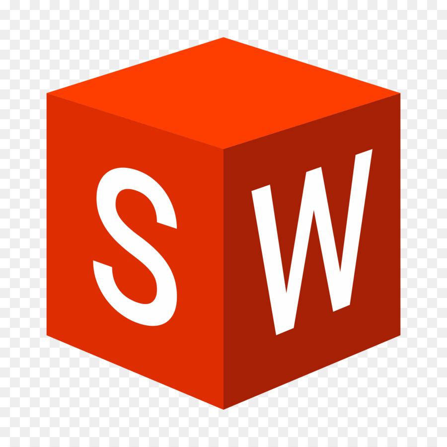
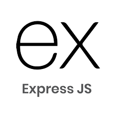

<!-- ### Hi there 👋 -->

<!--
**salvantjeff/salvantjeff** is a ✨ _special_ ✨ repository because its `README.md` (this file) appears on your GitHub profile.

Here are some ideas to get you started:

- 👯 I’m looking to collaborate on ...
- ⚡ Fun fact: I enjoy drawing and playing soccer
-->

# Hi there, I'm Jeff 👋 

## I'm a software engineering student and a mechanical engineer!!

- 😄 Pronouns: he/him
- 🔭 I’m currently working on youtube clone
- 🌱 I’m currently learning more about Node.js, Express, and MongoDB.
- 🥅 2023 Goals: build more complex projects like a youtube clone 
- ⚡ Fun fact: I love to draw and play soccer

### Connect with me:

&nbsp;&nbsp;

### Languages and Tools:

